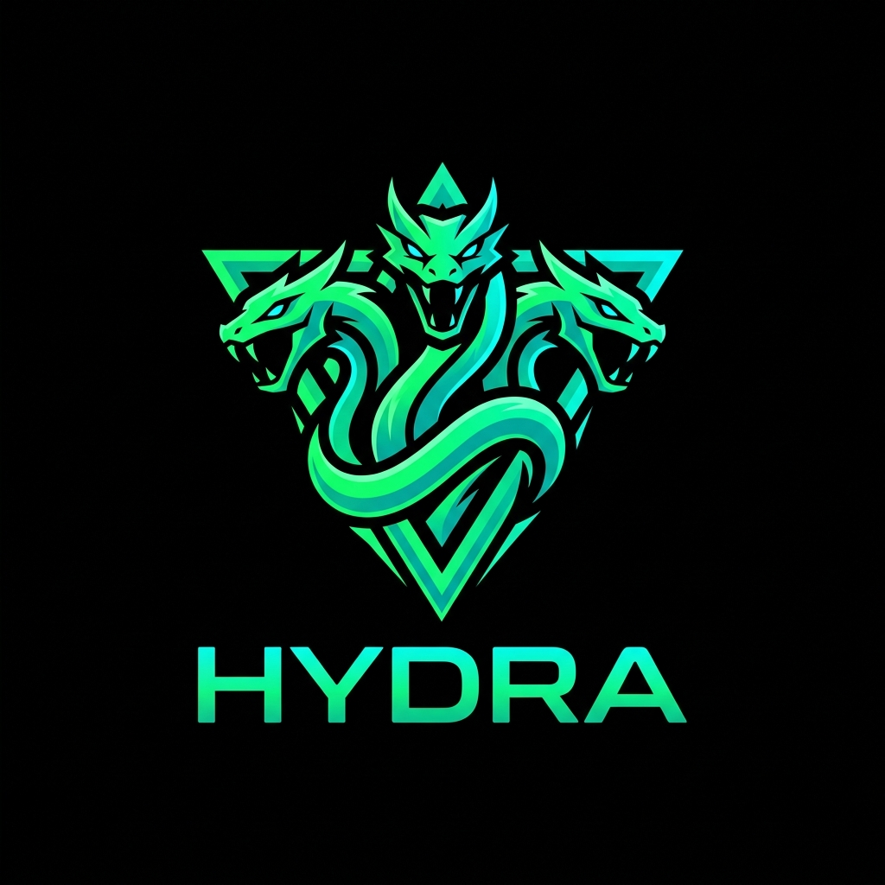

<div align="center">



# Hydra ADE

**Autonomous Development Environment for Parallel AI Agent Fleets**

[](https://github.com/renanbs/hydra)
[](https://tauri.app/)
[](https://www.rust-lang.org/)
[](https://react.dev/)
[](https://tailwindcss.com/)
[](https://sqlite.org/)
[](#)

</div>

---

## ⚡ Overview

**Hydra ADE** is a high-performance Autonomous Development Environment purpose-built for orchestrating fleets of parallel AI coding agents.

It combines the dense, keyboard-driven user experience of **Orca IDE** (shadcn/ui New York style, worktree fleet sidebar, virtualized file explorer, command palette, Monaco diffs) with the crash-proof, headless virtual terminal architecture of **Herdr** (Rust PTY daemon, in-memory `vt100` shadow buffers, and SQLite WAL persistence).

---

## 🏛️ System Architecture

```
Hydra Host
├── Rust Core Daemon (Tauri v2 + Tokio)
│   ├── PTY Manager (`portable-pty`) ── Async OS process spawning
│   ├── Headless Terminal Buffer (`vt100`) ── In-memory screen authority (<200 KB RAM)
│   ├── Herdr State Engine ── Real-time state classification (WORKING / BLOCKED / IDLE)
│   ├── Log Folding Pipeline (`fold_terminal_output`) ── Cuts LLM prompt tokens up to 90%
│   ├── Git Worktree Engine ── Safe branch isolation & worktree lifecycle management
│   ├── Power Management (`keepawake`) ── Prevents system sleep during active agent tasks
│   ├── Session Storage ── Atomic SQLite WAL at `~/.config/hydra/hydra_sessions.sqlite3`
│   └── Window Chrome ── Wayland native dragging & geometry restoration
│
└── Frontend (React 19 + TypeScript + Tailwind CSS v4)
    ├── Custom Titlebar ── Frameless window controls (Orca 46x36px hit targets)
    ├── Left Sidebar ── Fleet & Worktree Manager (parallel git branches & agent status)
    ├── Center Workbench ── Multi-tab interactive surface (`@xterm/xterm` + Monaco Diff)
    └── Right Sidebar ── Virtualized File Explorer, Ripgrep search, Source Control & Open In Apps
```

---

## ✨ Key Features

### 🤖 Parallel Fleet & Git Worktree Orchestration
- Run multiple coding agents concurrently, each isolated in its own git worktree and branch.
- Instant workspace switching without dirty working-directory conflicts or context contamination.
- Real-time agent status badges (`WORKING`, `BLOCKED`, `IDLE`).

### 🦀 Headless PTY & Shadow Virtual Terminal Buffer
- Decoupled background daemon: long-running compilations, test suites, or agent scripts live in the Rust backend.
- Closing or reloading the frontend never terminates active tasks.
- Output parses into an in-memory `vt100` buffer with zero visual UI lockup, even during massive log dumps.

### 🧠 Token-Saving Log Folding
- Raw build and test traces consume massive token budgets when fed to LLMs.
- Hydra's `fold_terminal_output` engine intelligently retains crucial header information and error tails while collapsing repetitive outputs, reducing context token overhead by up to 90%.

### 🎨 Orca-Grade Visual & Interaction Fidelity
- **Frameless Window Chrome**: Native Wayland window dragging (`start_dragging()`) with precision controls.
- **Monaco Diff Viewer**: Side-by-side and inline visual code review for agent-proposed edits.
- **High-Performance Terminal**: Powered by `@xterm/xterm` with Nerd Font support and curated dark/light themes.
- **Command Palette (`cmdk`)**: Quick navigation, action dispatching, and workspace switching.

### 📂 Integrated Source Control & File Explorer
- Virtualized file tree capable of handling large monorepos with minimal memory overhead.
- Native ripgrep file search and inline git change tracking.
- Contextual *"Open In"* integration for external editors (VS Code, Cursor, Zed, Sublime).

### ☕ Process Reliability & Keep-Awake
- Native power management keeps the host awake while long-running agent tasks or test suites are executing.

### 💾 Crash-Proof Persistence
- Full session state, workspace histories, and window geometry persisted atomically via `rusqlite` in WAL mode.

---

## 🛠️ Tech Stack

| Layer | Technologies |
|---|---|
| **Native Core** | Rust 2021, Tauri v2, Tokio, `portable-pty`, `vt100`, `rusqlite`, `keepawake`, `notify` |
| **Frontend UI** | React 19, TypeScript, Vite, Tailwind CSS v4, Lucide Icons |
| **Workbench & Editors** | `@xterm/xterm`, `@monaco-editor/react`, `cmdk` |
| **Persistence** | SQLite with WAL mode (`~/.config/hydra/hydra_sessions.sqlite3`) |
| **Target Platform** | Linux (Wayland & X11), macOS, Windows |

---

## 🚀 Getting Started

### Prerequisites

Ensure you have the following installed on your system:
- **Node.js** (v20+ recommended) & **pnpm**
- **Rust & Cargo** (stable toolchain)
- **Tauri v2 System Dependencies** (Linux):
  ```bash
  # Debian/Ubuntu
  sudo apt install libwebkit2gtk-4.1-dev build-essential curl wget file libxdo-dev libssl-dev libayatana-appindicator3-dev librsvg2-dev

  # Arch Linux
  sudo pacman -S --needed webkit2gtk-4.1 base-devel curl wget openssl appmenu-gtk-module libappindicator-gtk3 librsvg
  ```

### Installation

1. **Clone the repository:**
   ```bash
   git clone git@github.com:renanbs/hydra.git
   cd hydra
   ```

2. **Install frontend dependencies:**
   ```bash
   pnpm install
   ```

### Development

Run the full development stack (Vite frontend + Tauri Rust daemon):

```bash
pnpm tauri dev
```

### Production Build

Compile an optimized, stripped release binary and application bundle:

```bash
pnpm tauri build
```

---

## ⌨️ Shortcuts & Ergonomics

| Shortcut / Action | Description |
|---|---|
| `Ctrl+P` / `Cmd+P` | Open Command Palette |
| `Ctrl+\`` / `Cmd+\`` | Toggle Terminal Workbench tab |
| `Alt+Drag` / Header Drag | Move window (native Wayland protocol) |
| `New Worktree (+)` | Spawn new isolated agent branch |

---

## 📄 License

MIT © [Renan Biegelmeyer](https://github.com/renanbs)
